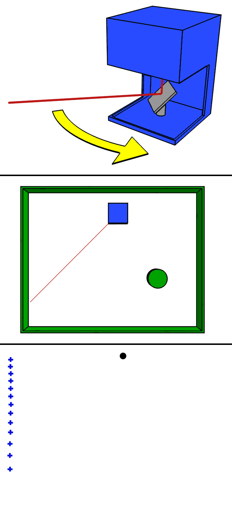

LiDAR
================================================================================

参考

激光雷达又称 **光学雷达**, 最初是英文 `Light Detection And Ranging` 的缩写. 不过目前没有达成共识,
同时存在 `lidar`, `LIDAR`, `Lidar`, `LiDAR` 等用法. 这里采用 `LiDAR`.

根据 `wikipedia <https://en.wikipedia.org/wiki/Lidar#History_and_etymology>`_ 的解释,
机械式激光雷达基本工作情况如下图所示:

.. note::
    下图中的激光只有 1 个, 实际情况中可能有 16 个, 128 等多种情况.
    比如: vlp16 型号有 16 个(一般称16 线激光雷达), 且 16 个激光是按照固定顺序依次发送的, 并非同时发送.

.. toctree::
    :hidden:

    vlp16
