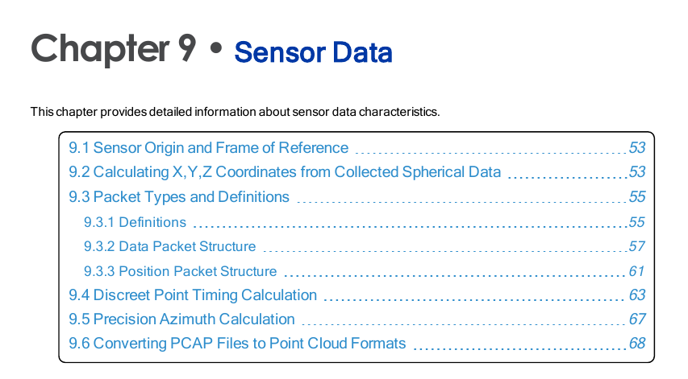
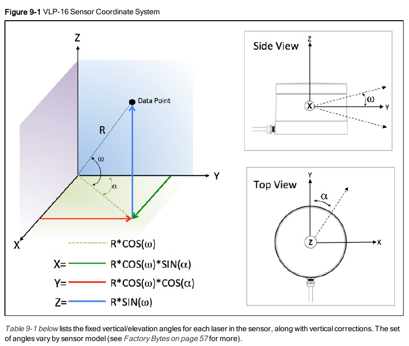
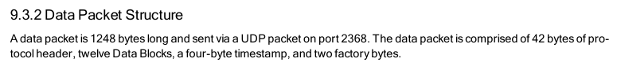
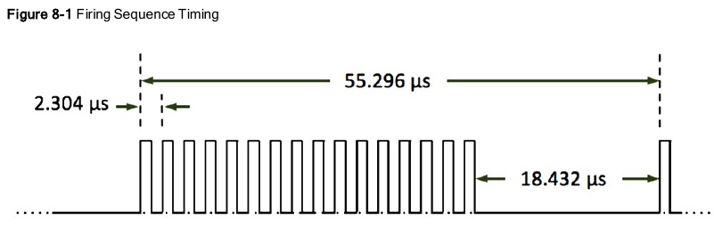
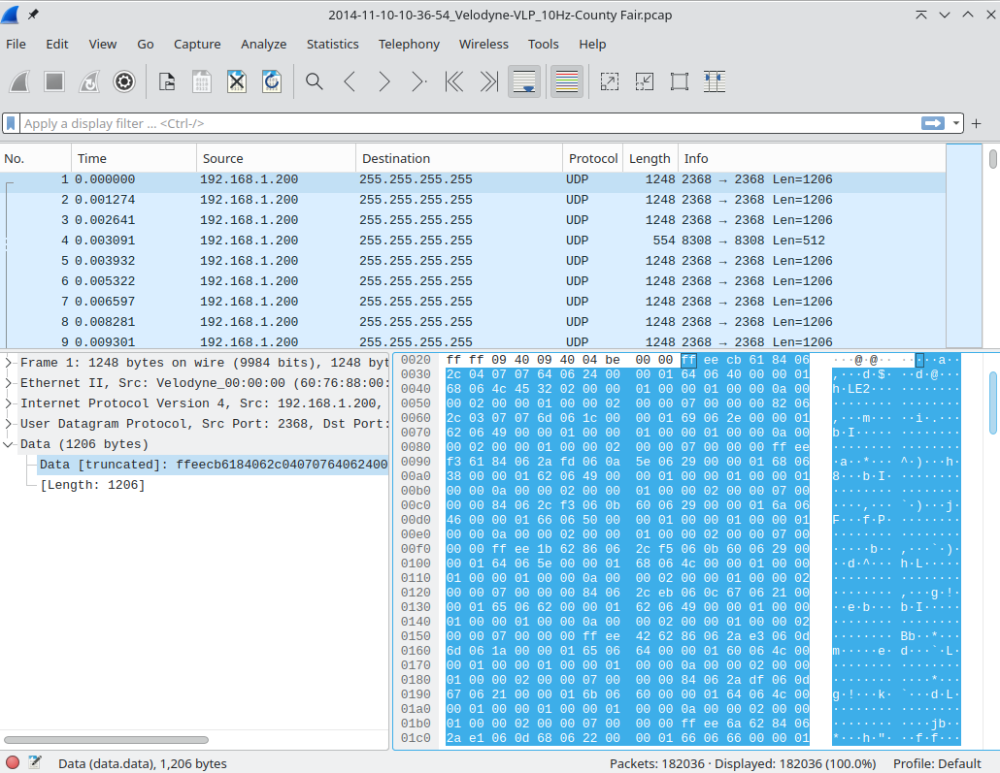
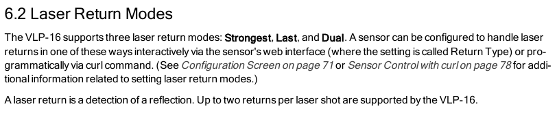
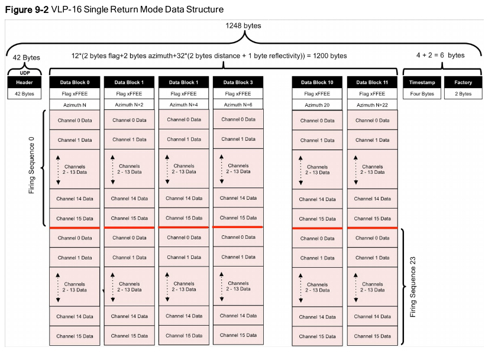
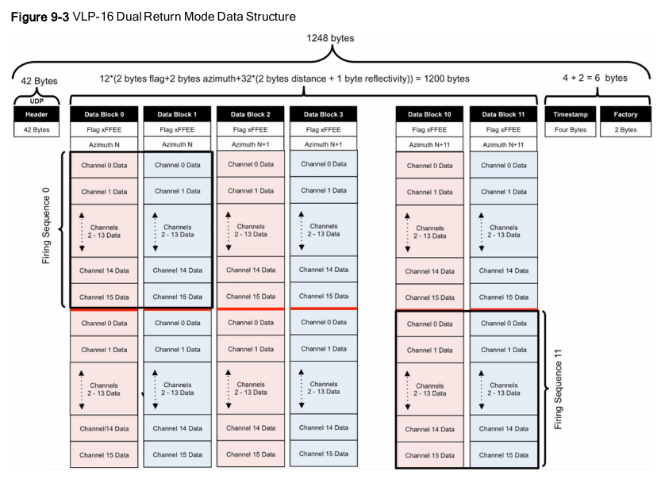
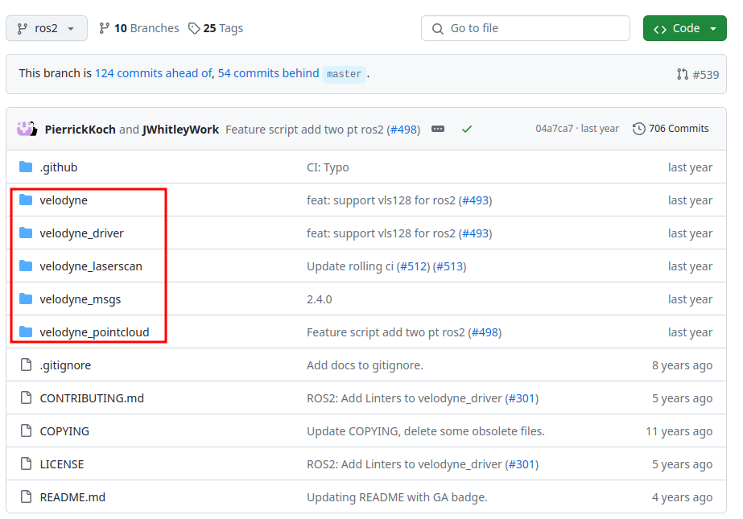

vlp16
--------------------------------------------------------------------------------

背景
^^^^^^^^^^^^^^^^^^^^^^^^^^^^^^^^^^^^^^^^^^^^^^^^^^^^^^^^^^^^^^^^^^^^^^^^^^^^^^^^

vlp16 是 velodyne 公司推出的一款 16 线(channel)的激光雷达, 详情参数请查看 `官网 <https://ouster.com/products/hardware/vlp-16>`_.

.. note::
    在 2022 ~ 2023 年左右, Velodyne 和 Ouster 两家公司合并(`见该链接 <https://investors.ouster.com/news/news-details/2023/Ouster-and-Velodyne-Complete-Merger-of-Equals-to-Accelerate-Lidar-Adoption/default.aspx>`_), 同时 velodyne 的官网下线, 一些在线资料都已经无法找到了. 目前官网为 `https://ouster.com/ <https://ouster.com/>`_, 但是没有 velodyne 的相关资料的下载入口.

.. _`vlp16 user manual`: https://docs.clearpathrobotics.com/assets/files/clearpath_robotics_023729-TDS2-2c7454cf9f317be53ce1938dca7ddcf4.pdf

点击 `vlp16 user manual`_ 下载用户手册(来自网络搜索, 非官方下载地址, 仅供参考). 原始数据格式见 `用户手册第 9 章`

首先我们需要大致了解激光雷达的基本原理.

激光发射器充电发射脉冲激光, 激光经过物体(距离记为 ``d``)反射, 经过 ``t`` 时间后被接收器接收;
那么可以得到公式: ``d = (s * t) / 2``, 其中 s 为光速. 使用下图中所示公式, 可以将 **极坐标系** 下的点坐标
转化成笛卡尔坐标系下的点坐标.

简而言之, 我们需要获取每个点的 ``R``, ``α``, ``ω``. 其中:

- _`R` 表示为相对距离, 可以从原始数据中直接读取.
- _`α` 表示为激光发射时水平偏转角度, 可以从原始数据中读取.

    - 一般情况下, 激光雷达电机是匀速转动, 所以, ``α`` 与时间有个线性关系, 即已知原始 ``α``,
      可以通过时间偏移计算任意时刻的 ``α``.

- _`ω` 表示为激光发射时相对于安装平面的垂直偏转角度, 在正常工况下, 不会变化. 所以, 查 `vlp16 user manual`_ **Table 9-1** 即可.

原始数据格式 packet
^^^^^^^^^^^^^^^^^^^^^^^^^^^^^^^^^^^^^^^^^^^^^^^^^^^^^^^^^^^^^^^^^^^^^^^^^^^^^^^^

.. note::
    这个所示的 **原始数据格式** 是指从直接 LiDAR 获取到的数据, 并非经过标准化的 **文件格式**.

包长度为 1248 字节, 通过 udp 的 2368 端口发送. 其中包含 42 个 协议头; 即真正数据为 1206 字节: 12 个数据 block, 4 字节时间戳, 2 字节工厂标记.

这里, 引入一个名词: _`firing sequence`, 指激光雷达所有激光发射器依次充电发射接收一次的完整过程.
vlp16 执行一次 **firing sequence** 需要 **55.296 us**, 详情参考 `vlp16 user manual`_ **Chapter 8**.
每个激光点(channel)发射需要 **2.304 us**, 全部发送接收完成一次后, 需要休息 **18.432 us** (猜测留出时间来散热),
总计 ``2.304 * 16 + 18.432 = 55.296 us``
详情如下图所示:

基于此, 我们可以计算得到更多的信息(这里额外说明一下, 这里仅指单回波模式, 若双回波模式, 有些数据还需要翻倍):
- ``24 * 55.296 us= 1.327 ms``, 相邻 udp 报文中至少需要 1.327 ms 时间
- ``1 packet * 1 s / 1.327 ms = 753.5 packets/second``, 每秒可接收到 753.5 个报文
- ``753.5 * 1248 bytes = 940368 bytes/second = 918 KB/s``, 占用约 918 KB/s 带宽
- ``753.5 * (12 * 32) = 289344 laser measurements per second``

下面直接给出 c++ 结构体来帮助理解数据格式, 强烈建议配合用户手册中的图表来理解.

.. code-block:: cpp

    struct Point {
        uint16_t distance;      // 距离
        uint8_t intensity;      // 回波强度
    };

    struct DataBlock {
        uint16_t flag;          // 固定为 0xFF, 0xEE 由于是小端存储, 所示应为 0xEEFF
        uint16_t azimuth;       // 方位角的角度值的 100 倍, 也就是说方位角精确到小数点后 2 位
        Point points[32];       // 每个点的方位角度都不同
    };

    struct Packet {
        // int8_t udp_header[42];   // 在实际 socket 编程中, header 头部由协议栈处理
        DataBlock block[12];
        uint64_t timestamp;         // 注意小端存储
        uint8_t mode;               // 模式
        uint8_t product;            // 产品 id. 0x22 表示 vlp16(也有可能表示 vlp16 的升级版 Puck LITE)
    }

在 `kitware data <https://data.kitware.com/#collection/5b7f46f98d777f06857cb206/folder/5b7fff608d777f06857cb539>`_,
我们找到一个公开的 vlp16 型号的原始数据 pcap 包的下载连接, pcap 文件可以使用 ``wireshark`` 打开, 如下图所示.

- block[0].flag: ``ff ee``
- block[0].azimuth: ``cb 61``

  - 小端, 即 ``0x61cb = 25035``
  - ``25035 / 100 = 250.35 °`` (这里使用一个固定系数来将 ``float`` 转成 ``uint16_t`` 来减少数据量, 也常见于经纬度处理)

- block[0].points[0]: `84 06 2c`:

  - distance: ``84 06``

    - 小端, 即 ``0x0684 = 1668``
    - 分辨率 2 mm, 即 ``1668 * 2 mm = 3.336 m``

  - intensity: ``2c``:

.. note:: 计算过程也可参考用户手册 Figure 9-4 和 Figure 9-5

这样一来, 所有点的 `R`_ 值都可以获取到.

每个 ``DataBlock`` 中都包含 **32** 个点, 其分为两组, 每组 16 个点(**firing sequence**), 编号(索引)依次为 0~15.
有了索引编号(这里不需要关注发射时间), 根据上文中 `ω`_ 提到的方法, 查表获取所有点的 ``ω``.

.. .. note:: 再次想象一下激光雷达每个激光点的发射: 电机带动激光发射器水平方向匀速转动, 垂直不均匀分布的 16 个发射点依次间隔发射...

最后, 我们计算最为复杂的 ``α``. 基本原理时, 电机匀速转动, 相邻两个 ``DataBlock`` 所有点(总共 64 个), 任意两点的 ``方位角差 / 时间差`` 是一个定值,
且这个定植可以通过 ``相邻两个 DataBlock 的方位角差 / 55.296 us`` 来计算(注意方位角差为负需要加上 360)得到.
如果已知所有点的时间和任意一点的方位角, 就可以求出所有点的方位角了. 每个 ``DataBlock`` 都有一个基准 ``azimuth``, 表示为第 ``0`` 个点的方位角(``azimuth``),

这里, 我们需要引入一个新的名词 **回波模式 (return mode)**,
详情参考 `vlp16 user manual`_ **6.2 Laser Return Modes**.

- 单回波模式: 最强(strongest), 最后(last)
- 双回波模式: 双回波(dual). 相对于单回波模式, 双回波模式下数据量翻倍.

单回波模式下, **firing sequence** 如下图所示.

双回波模式下, **firing sequence** 如下图所示.

在上文 `firing sequence`_ 可以看到, 由于存在 **18.432 us** 的 **散热** 时间, 不能简单的使用比例 ``55.296 / 16``.

``DataBlock_azimuth_delta / 55.296 us = (Azimuth_i - Azimuth_0) / (k * 2.304 us); ( 0 <= i < 16)``

``DataBlock_azimuth_delta / 55.296 us = (Azimuth_i - Azimuth_0) / ((k - 16) + 55.296) * 2.304 us); (16 <= i < 32)``

我们得到了每个点的 ``azimuth``, 也就是 `α`_. 我们可以计算得到所有点的坐标值(极坐标系),
并可以转换到激光雷达的笛卡尔坐标系下.
然后, 根据激光雷达的标定参数(激光雷达在车身坐标系的坐标)可将所有激光雷达点坐标转换到车身坐标系下.
至此, 可以将激光雷达点转换到其他与车身坐标系有转换关系的任何坐标系中.

ros-$(ros_distro)-velodyne-driver
^^^^^^^^^^^^^^^^^^^^^^^^^^^^^^^^^^^^^^^^^^^^^^^^^^^^^^^^^^^^^^^^^^^^^^^^^^^^^^^^

代码见: `https://github.com/ros-drivers/velodyne/tree/ros2 <https://github.com/ros-drivers/velodyne/tree/ros2>`_

.. note::
   #. 需要对 ros 的 msg 有一些初步的了解.
   #. 这里虽然查看的是 ros2 的分支, 但是基本不会影响对 ros1 中的理解.

#. **velodyne**: 使用命令行安装时(``sudo apt install ros-jazzy-velodyne``), 安装这个包就可以, 它依赖下面的四个包. 该包仅包含一些 **launch** 文件.
#. **velodyne_msgs**: 顾名思义, 定义了 velodyne 相关的 **msgs**.
#. **velodyne_driver**: 提供从 **pcap** 或 **socket** 读取激光雷达数据的节点, 发布类型为 **velodyne_msgs** 中定义的消息类型的数据. 仅做了一层数据封装.
#. **velodyne_pointcloud**: 订阅 **velodyne_msgs::msg::VelodyneScan**, 转换并发布 **sensor_msgs::msg::PointCloud2**.
#. **velodyne_laserscan**: 订阅 **sensor_msgs::msg::PointCloud2**, 转换并发布 **sensor_msgs::msg::LaserScan**.

.. mermaid::

    flowchart TD;
    pcap(pcap file) -- 1206 bytes --> velodyne_driver;
    socket(udp socket) -- 1206 bytes --> velodyne_driver;
    velodyne_driver --- velodyne_msgs("`velodyne_msgs::msg::VelodyneScan
    in velodyne_msgs`")
    velodyne_msgs --- velodyne_pointcloud;
    velodyne_pointcloud -- sensor_msgs::msg::PointCloud2 --> velodyne_laserscan;
    velodyne_laserscan -- sensor_msgs::msg::LaserScan --> sub(subscriber)
