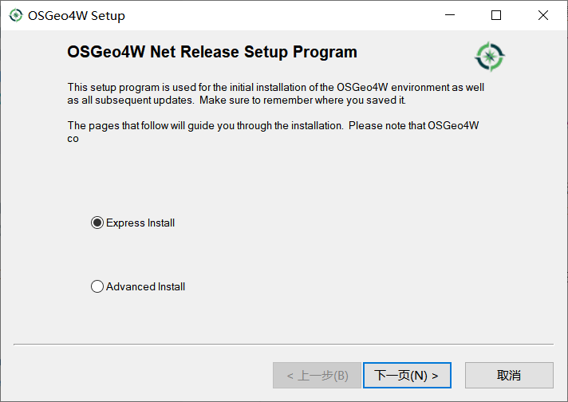
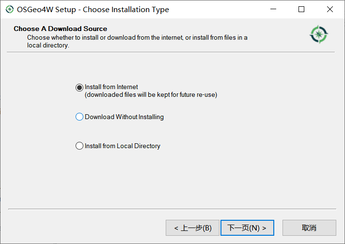
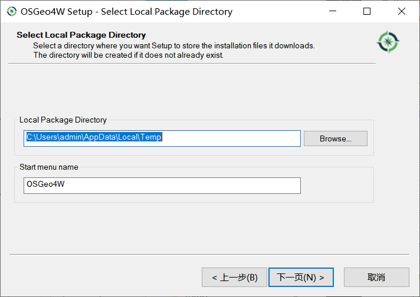
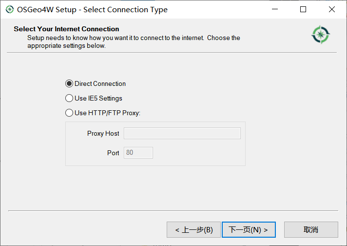
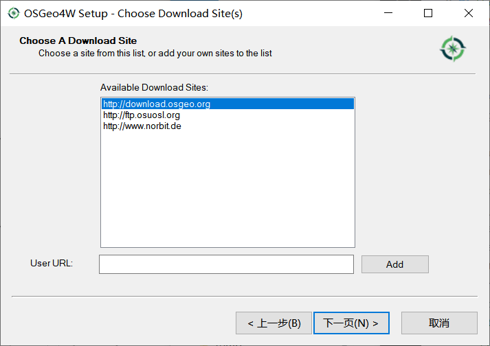
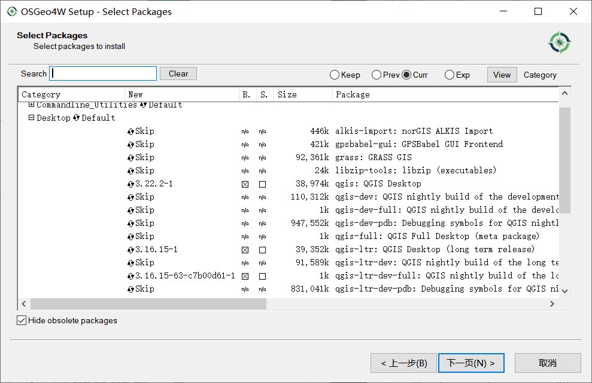
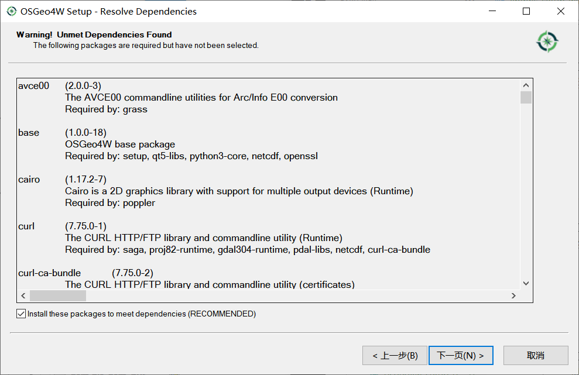
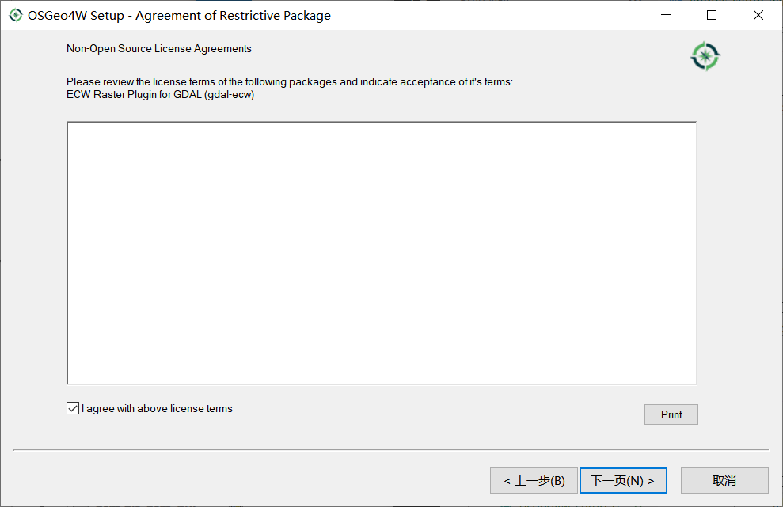
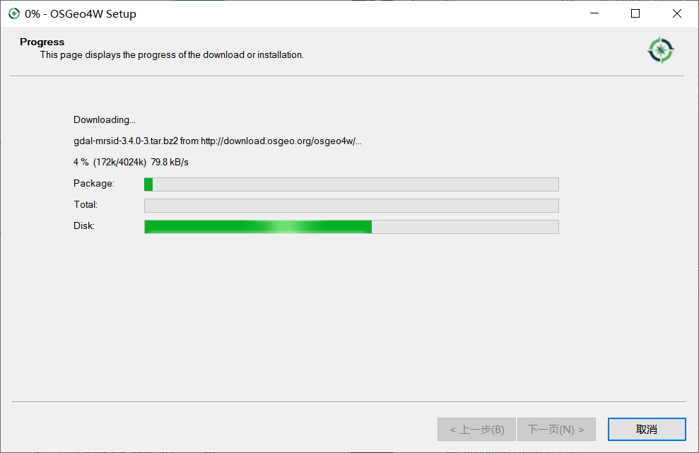

windows 下搭建 QGIS 二次开发环境
================================================================================

由于 QGIS 每经过几个版本, 都会保留一个长期支持版本(ltr), 同时其依赖的包有非常多, 比如 gdal, proj 等等, 在搭建环境之前, 请先考虑:

#. 对于 gdal 的版本有没有明确要求.
#. 对于 proj 的版本有没有明确要求.
#. 对于 Qt 的版本有没有要求, 这一项比较特殊.
#. 其他库的要求.

.. note::
    当前(2021年12月21日)最新的版本为 3.22.1, 最新的长期支持版本为 3.16.14, 次新的长期支持版本为 3.10.14

    如果没有明确要求, 选择 3.22.1 或 3.16.14 都可以; 如果对于某些库有明确的版本要求, 那么, 没有特别好的解决办法, 还请自行编译 QGIS 源码(不推荐).

使用 OSGeo4W 下载 QGIS 的开发包及其依赖包
--------------------------------------------------------------------------------

.. note::
    OSGeo4W is a binary distribution of a broad set of open source geospatial software for Windows environments (Windows 10 down to XP).

    (OSGeo4W 是适用于 Windows 环境（Windows 10 到 XP）的一组广泛的开源地理空间软件的二进制发行版。)

    OSGeo4W includes open source GIS desktop applications (QGIS, GRASS GIS), geospatial libraries (PROJ, GDAL/OGR, GEOS, SpatiaLite, SAGA GIS), scripting languages (Python) as well as many other geospatial related packages.

.. _`单独下载安装 QGIS`: https://qgis.org/en/site/forusers/download.html

.. _`OSGeo4W 下载界面`: https://trac.osgeo.org/osgeo4w

使用 OSGeo4W 可以下载安装 QGIS, 不需要 `单独下载安装 QGIS`_. 打开 `OSGeo4W 下载界面`_, 点击 ``OSGeo4W network installer`` 下载 ``osgeo4w-setup.exe``. ``osgeo4w-setup.exe`` 实际是一个在线下载器, 打开该下载器, 选中需要的库, 下载并自动安装.

.. warning::
    默认下载的 ``osgeo4w-setup.exe`` 仅能安装 最新版本的及最新长期支持版的 QGIS 及其依赖库, 暂时没有办法下载旧版本的 QGIS 及其依赖库.

    此时, 可以下载 QGIS ``3.16`` 版本的依赖库, 也可以通过 `osgeo4w-setup-x86_64-v1 <osgeo4w-setup-x86_64-v1.exe>`_ 下载 QGIS ``2.18`` 版本的依赖库, 但是没有找到下载 QGIS ``3.10`` 版本的依赖库的方式.

    额外提一句, ``debain 11`` 使用的仍是 QGIS ``3.10`` 的版本及其依赖库.

使用 osgeo4w-setup.exe
^^^^^^^^^^^^^^^^^^^^^^^^^^^^^^^^^^^^^^^^^^^^^^^^^^^^^^^^^^^^^^^^^^^^^^^^^^^^^^^^

    osgeo4w-setup-01

    如上图, 打开 osgeo4w-setup 后, 可以看到有两个选项: ``Express Install`` 和 ``Advanced Install``.
  
    Express Install 用于简单安装可执行程序(例如: ``QGIS``, ``GDAL`` 等等), Advanced Install 高级选项, 可以在线下载, 在线安装, 从本地安装 **软件包及其依赖包**.

    osgeo4w-setup-02

    如上图, ``Install from Internet`` 在线安装, ``Download Without Installing`` 仅下载不安装, ``Install from Local Directory``, 从本地文件夹安装.

.. figure:: imgs/osgeo4w-setup-03.png
    :alt: osgeo4w-setup select root install direcotry.
    :align: center

    osgeo4w-setup-03

    如上图, 选择安装路径, 后续使用 ``${OSGeo4W_root}`` 来表示. 建议剩余空间最小为10GB, 当前安装 3.16 版本后, 占用空间约9.5 GB.

.. [OSGeo4W_root] 这里选中的安装路径.

    osgeo4w-setup-04

    如上图, 选择下载安装包的临时保存路径, 默认即可.

    osgeo4w-setup-05

    如上图, 选择网络选项, 默认直连(Direct Connection)即可. 虽然代码库服务器在国外, 下载速度比较慢, 但又不是不能用(狗头).

    osgeo4w-setup-06

    如上图, 选择从哪个网站中下载, 其中 ``download.osgeo.org`` 是官方网站, 建议第一个; 如果有国内的镜像地址, 那么, 在下方的 ``Uesr URL`` 中添加并选中即可.

    osgeo4w-setup-07

    如上图所示, 有 6 列, 从左向右, 依次为 ``Category`` 类别; ``new`` 动作, 默认为 **安装**; ``B.`` 是否二进制; ``S.`` 是否源码; ``Size`` 内容数据大小; ``Package`` 包概述.

    如上图, 选中了 3 项, QGIS 3.22.2(当前最新版本, 38.974 MB), QGIS 3.16(当前最新的长期支持版本, 39.352 MB), qgis-ltr-dev-full 3.16.15(当前最新的长期支持版本开发包, 依赖关系文件 1 KB, 这里仅包含一些包的超链接, 后面会进一步解析).

    osgeo4w-setup-08

    如上图, 当选中 qgis-ltr-dev-full 后, 会自动检查依赖关系, 这里会列出被依赖但是未选中的包.

    osgeo4w-setup-09

    如上图, 同意以上所有许可协议. 当准备安装多个软件包时, 会出现多个界面提示用户同意许可协议, 同意即可, 否则, 无法点击下一步.

    osgeo4w-setup-10

    如上图, 下载过程较长, 等待下载完成即可. 下载完成后, 会自动调用注册表, 这个地方需要用户输入给出权限.

.. important::
    至此, windows 下的 QGIS 二次开发环境所需要的全部内容都已经 **下载完成**. 这里, 没有用 **安装完成**, 是因为有两个环境变量需要注意: 一个是 ``GDAL_DATA``, 值为 ``${OSGeo4W_root}/share/gdal``; 一个是 ``PROJ_LIB``, 值为 ``${OSGeo4W_root}/share/proj``. 这里的 ``${OSGeo4W_root}`` 即为 [OSGeo4W_root]_.
