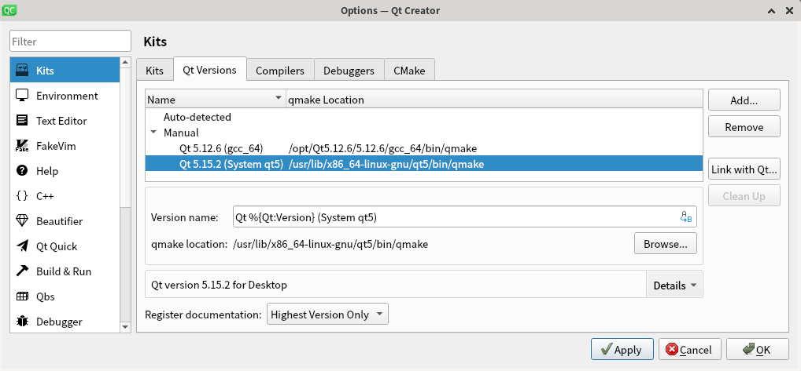

Linux 下使用 qmake 及 cmake 编译及运行 QGIS 程序
================================================================================

指定 Qt (qmake)
--------------------------------------------------------------------------------

    Qt Creator choose system's qmake

    如图, 选择系统 ``qmake``. 新建并使用 ``Kit`` 编译程序.

使用 qmake 编译
--------------------------------------------------------------------------------

    既然已经使用 Linux, 就不要再使用 qmake, 拥抱 ``CMake`` 吧. 若必须要用到 qmake, 参考 :doc:`Windows <libqgis_start_win>` 下的指南吧.

使用 CMake 编译
--------------------------------------------------------------------------------

    修改 ``CMakeLists.txt`` 文件.

.. code:: cmake

    if( UNIX ) {
        # 根据实际情况修改, 该文件夹下存在 FindQGIS.cmake
        set(CMAKE_MODULE_PATH "/usr/share/qgis;${CMAKE_MODULE_PATH}")

        find_package(QGIS COMPONENTS REQUIRED)

        # 设置程序的名称, 这里设置为 test_qgis.
        set(program_name test_qgis)
        target_compile_definitions( ${program_name}
                PRIVATE
            -D_USE_MATH_DEFINES
        )
        target_include_directories( ${program_name}
                PRIVATE
            ${QGIS_INCLUDE_DIR}
        )
        target_link_libraries( ${program_name}
                PRIVATE
            qgis_app
            qgis_core
            qgis_gui
        )
    }