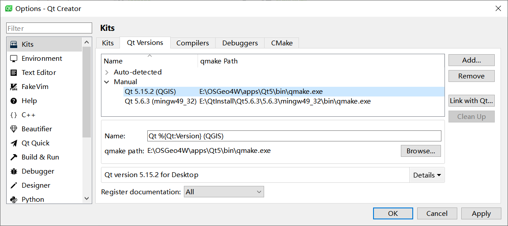
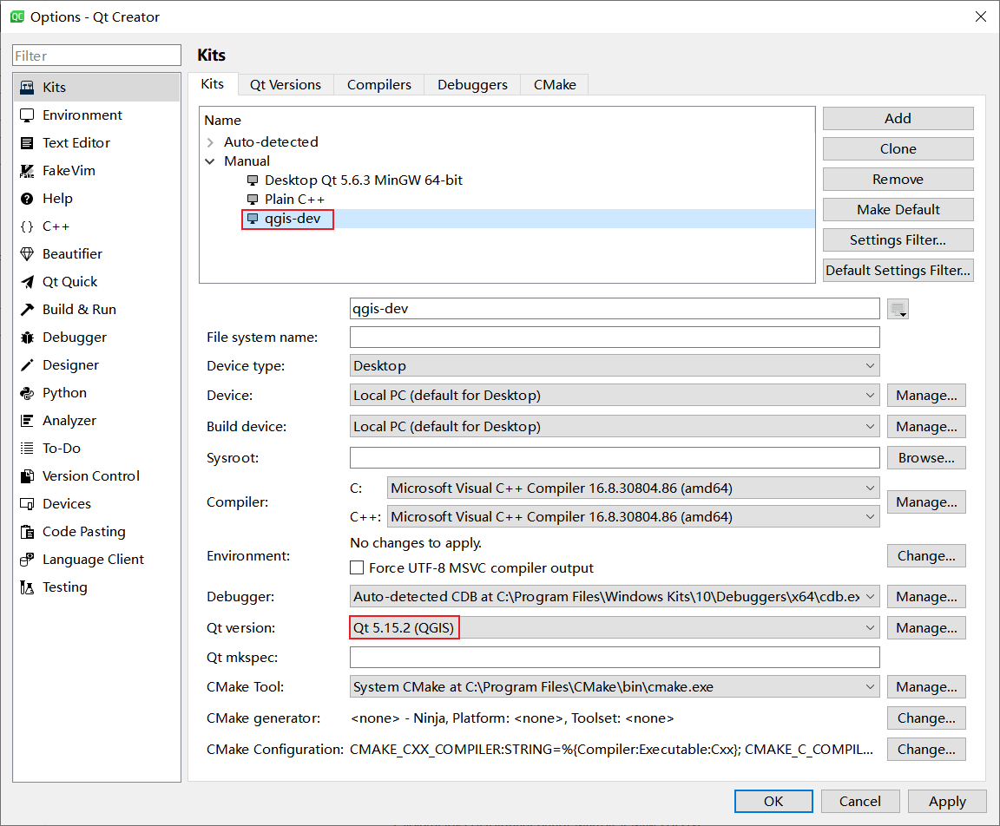

Windows 下使用 qmake 及 cmake 编译及运行 QGIS 程序
================================================================================

OSGeo4W 文件夹结构说明
--------------------------------------------------------------------------------

    待补充.

安装 Qt Creator 及指定 Qt
--------------------------------------------------------------------------------

请自行安装 Qt Creator.

QGIS 基于 Qt, 正常思路, 我们接下来需要安装 ``Qt`` 及 ``Qt Creator``; 但是由于 Qt 版本众多, 不同版本之间接口不完全相同. 所以, QGIS 的特定版本依赖于 Qt 的特定版本, Qt 的版本取决于 QGIS 的版本. 个人感觉基于此原因, 使用 OSGeo4W 下载时, 已经把对应版本的 Qt 下载到 ``${OSGeo4W_root}/apps/Qt5`` 文件夹下了, 这就是当前小标题中使用 ``指定`` 的原因.

    QtCreator Add Qt Version.

    如图, 打开 **QtCreator**, 菜单栏 **Tools** -> **Options** -> **Kits** -> **Qt Versions**, 点击 **Add** 弹窗选中 ``${OSGeo4W_root}/apps/Qt5/bin/qmake.exe`` -> **OK**

    QtCreator Add Kits.

    如图, 点击 **Add** 添加一个 **Kits**, 在 **Qt Version**: 下拉菜单中选中刚添加的 ``Qt 5.15.2 (QGIS)``, 之后使用该 ``Kits`` 编译程序即可. 正常来说, 不将 **一堆动态库** 复制到可执行目录下也可执行, 如果提示缺少 ``*.dll``, 那么就需要注意了, 此时不能使用 ``debug`` 编译, 需要使用 ``release`` 编译, 然后下面下述三个位置的所有 ``dll`` 复制到生成的可执行程序(exe) 同级目录下, 然后将 ``${OSGeo4W_root}/apps/Qt5/plugins`` 文件夹中的 ``platforms`` 文件夹也同样复制到 exe 的同级目录下.

    - `${OSGeo4W_root}/bin`
    - `${OSGeo4W_root}/apps/qgis-ltr-dev/bin` 这里的 ``qgis-ltr-dev`` 与安装的 **QGIS** 版本有关.
    - `${OSGeo4W_root}/apps/Qt5/bin`

.. note::
    若想正确使用运行程序, 需要三个方面:
    - 编译前正确指定 ``lib`` 库地址 和 ``include`` 头文件地址.
    - 能够识别到 ``dll`` 或 ``so`` 动态依赖库.
    - 指定正确的环境变量 ``GDAL_DATA`` 和 ``PROJ_LIB``; 与前两项不同, 这里指定错误, 程序仍能成功运行, 但是无法显示正确的地图内容.

使用 qmake 编译
--------------------------------------------------------------------------------

    修改 ``.pro`` 文件, 这里仅列出涉及到 QGIS 的更改.

.. code-block::

    win32: {
        # 防止出现 PI 未定义的情况.
        DEFINES += \
        _USE_MATH_DEFINES

        # ${OSGeo4W_root} 为 D:/OSGeo4W
        qgis_dev_path = D:/OSGeo4W/apps/qgis-ltr-dev

        LIBS += -L$${qgis_dev_path}/lib/ -lqgis_gui -lqgis_core -lqgis_app \

        INCLUDEPATH += $${qgis_dev_path}/include
        DEPENDPATH += $${qgis_dev_path}/include
    }

使用 cmake 编译
--------------------------------------------------------------------------------

    修改 ``CMakeLists.txt`` 文件, 这里仅列出涉及到 QGIS 的更改.

`CMake 判断系统类型 <https://cmake.org/cmake/help/v3.22/manual/cmake-variables.7.html#variables-that-describe-the-system>`_

.. code:: cmake

    if( WIN32 )
        # 根据实际情况修改.
        set(QGIS_FOUND "E:/OSGeo4W/apps/qgis-ltr-dev/lib")
        # 根据实际情况修改, 该文件夹下存在 FindQGIS.cmake
        set(CMAKE_MODULE_PATH "E:/OSGeo4W/apps/qgis-ltr-dev;${CMAKE_MODULE_PATH}")

        find_package(QGIS COMPONENTS REQUIRED)

        # 设置程序的名称, 这里设置为 test_qgis.
        set(program_name test_qgis)
        target_compile_definitions( ${program_name}
                PRIVATE
            -D_USE_MATH_DEFINES
        )
        target_include_directories( ${program_name}
                PRIVATE
            ${QGIS_FOUND}/../include
        )
        target_link_libraries( ${program_name}
                PRIVATE
            qgis_app
            qgis_core
            qgis_gui
        )
    endif()
